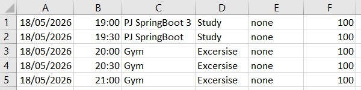
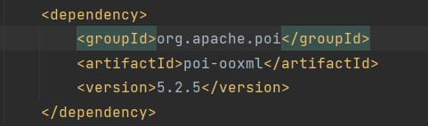
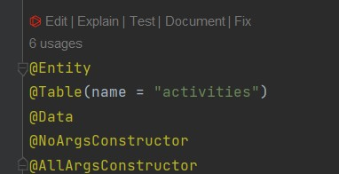
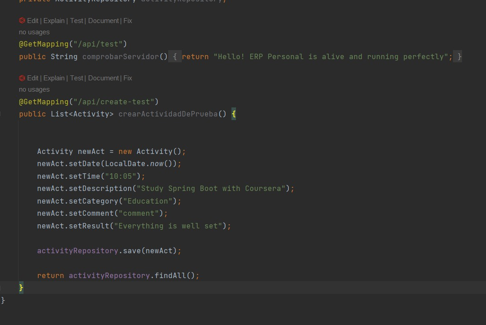
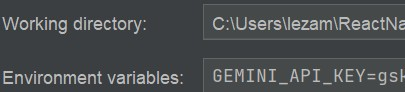
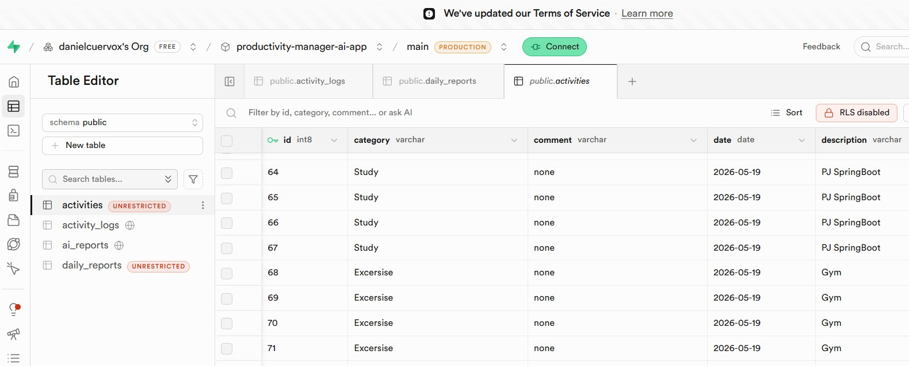
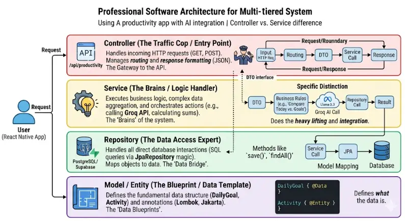
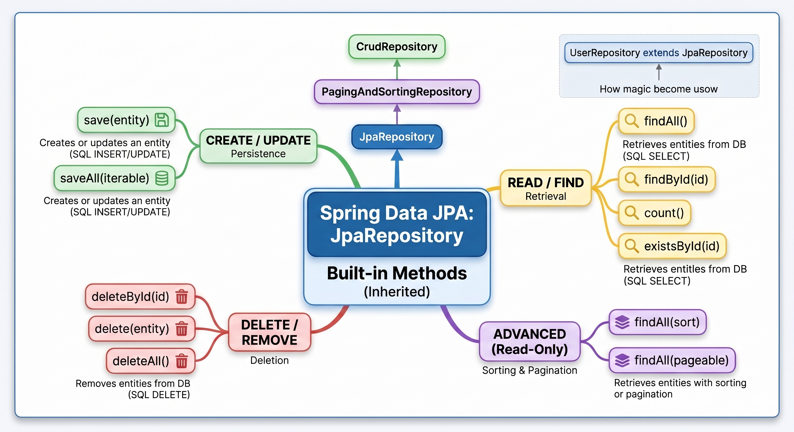

### Initial Backend Architecture
Here you can see the data structure design that I am loading from Excel:

## 2026-05-18: Excel Integration Setup
- **Context:** Implementing the data import layer to bridge Excel files with the database.
- **Dependency:** Added `org.apache.poi` (`poi-ooxml`) to `pom.xml`.
- **Strategy:** Utilizing Apache POI to stream Excel data, allowing for cell-by-cell reading and parsing into a JSON-compatible format for further processing.
- **Visual Reference:**
  

## 2026-05-19: Streamlining Java Code with Lombok
- **Context:** Optimization of entity classes in the backend.
- **Tool:** Project Lombok.
- **Strategy:** Replaced manual getter/setter and constructor declarations with the `@Data` annotation to reduce boilerplate code.
- **Visual Reference:**
  
- **Key Learning:** Productivity in Java is significantly boosted by using compile-time code generation tools. This keeps entities clean, readable, and highly maintainable, allowing the developer to focus on the application logic rather than repetitive structure.

## 2026-05-19: Server Sanity Check and Data Persistence Testing
- **Context:** Verifying the basic operational state of the backend before moving to cloud-based infrastructure.
- **Strategy:** Created a test endpoint (`/api/create-test`) to inject dummy data directly into the application's runtime memory.
- **Objective:** Confirm that the Spring Boot server is correctly routing requests, interacting with the JPA repository, and managing object lifecycle without external dependencies.
- **Visual Reference:**
  
- **Key Learning:** Establishing a "hello world" style verification endpoint at the beginning of development prevents hours of debugging later. By isolating the persistence layer from the cloud configuration, I ensured that the core logic was sound before introducing external variables like Supabase connections or API integrations.

## 2026-05-20: Security and Environment Configuration
- **Context:** Implementing secure credential management for external API integration.
- **Strategy:** - Moved sensitive configuration (API Keys) into a local `.env` file.
  - Added `.env` to `.gitignore` to prevent leaking secrets into the version control system (GitHub).
  - Configured Spring Boot to consume these values as system environment variables.
- **Visual Reference:**
  
  
- **Key Learning:** Never hardcode secrets. By decoupling credentials from the source code, I ensure that the repository remains safe to share or open-source without exposing private access tokens. This approach facilitates portability across different environments (dev/prod) without changing the code itself.

## 2026-05-20: Cloud Persistence Migration (Supabase)
- **Context:** Transitioning from local H2 (in-memory) persistence to a production-ready cloud database.
- **Strategy:** Configured Spring Boot `DataSource` to connect with the external Supabase PostgreSQL instance.
- **Achievement:** Successfully migrated the data flow, ensuring that information persists across server restarts and is accessible globally.
- **Visual Reference:**
  
  
- **Key Learning:** The "Local-First" approach—prototyping in memory and then migrating to the cloud—is a powerful methodology. It allows for rapid development without the overhead of cloud latency or connection issues, confirming that the business logic is solid before dealing with distributed system complexity.

## 2026-05-21: Architecture Standardization (Controller-Service-Repository-Entity)

- **Context:** Refactoring and aligning the project structure to follow a professional, multi-layered architectural pattern for maintainability and scalability.
- **Strategy:** - Adopted a clear separation of concerns by delegating specific responsibilities to distinct layers:
  - **Controller:** Acts as the entry point, managing HTTP traffic and request/response mapping.
  - **Service:** Houses the "brains" of the application, orchestrating business logic and complex integrations (like AI calls or data aggregations).
  - **Repository:** Serves as the data access expert, handling direct communication with the database using JPA.
  - **Entity:** Defines the foundational data blueprints that structure the application's domain model.
- **Visual Reference:**
  
- **Key Learning:** This layered approach is fundamental for building robust applications. By strictly decoupling the Controller (entry point), Service (logic handler), and Repository (data access), I ensure that the code is modular and testable. Visualizing this flow serves as a "north star" for my development process, ensuring that every new feature I implement—such as the `WeeklyGoal` entity—respects the boundaries of the architecture and maintains a clean, professional standard.

## 2026-05-21: Mastering Spring Data JPA Built-in Methods

- **Context:** Consolidating knowledge on the `JpaRepository` interface and its inherited capabilities to optimize database interactions without writing manual SQL.
- **Strategy:** - Leveraged the power of Spring Data JPA’s inheritance hierarchy (`CrudRepository` -> `PagingAndSortingRepository` -> `JpaRepository`) to access standard persistence operations:
  - **CREATE/UPDATE:** Utilized `save()` and `saveAll()` for seamless entity persistence.
  - **READ/FIND:** Employed `findById()`, `findAll()`, and `existsById()` for efficient data retrieval.
  - **DELETE/REMOVE:** Implemented `deleteById()`, `delete()`, and `deleteAll()` for robust record management.
  - **ADVANCED:** Integrated sorting and pagination (`findAll(pageable)`) to handle large datasets effectively.
- **Visual Reference:**
  
- **Key Learning:** Understanding that `JpaRepository` provides these "out-of-the-box" methods allows me to focus on business logic rather than boilerplate CRUD code. By extending `JpaRepository` in my custom repositories, I gain access to powerful, pre-tested data access patterns that ensure consistency, reduce the margin for error, and significantly accelerate development time.

## 2026-05-20: Architecture Definition and Synchronization
- **Context:** Starting backend development for a React Native mobile application.
- **Data Strategy:** Data is initially centralized through an Excel file, allowing for rapid iterations before connecting a real-time data source.
- **Challenge:** Ensuring data consistency between the input file and Supabase.
- **Visualization:**
  
- **Key Learning:** Separating the cleanup (DELETE) and upload (POST) endpoints is fundamental to maintain control over the database state during the development phase.